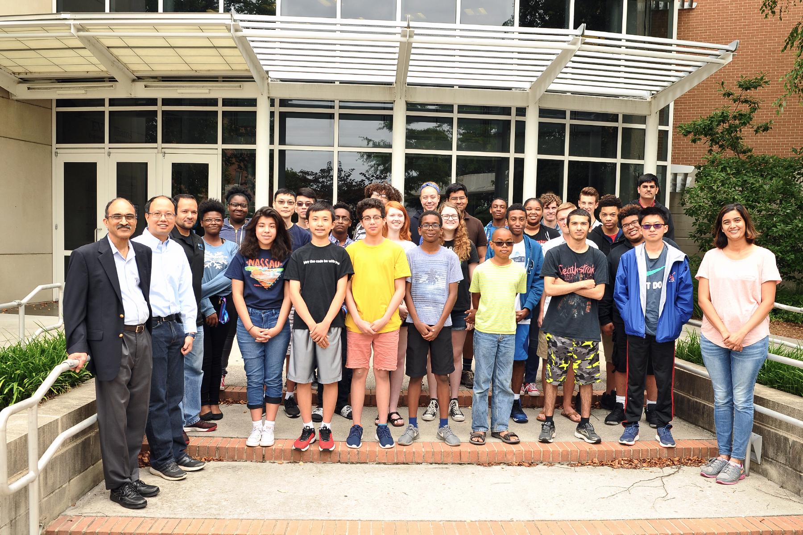

### Volunteering at Old Dominion University, Norfolk, Virginia.

Machine Learning and Data Science Camp was organized by the Department of Computer Science at Old Dominion University in collaboration with the Virginia Space Grant Consortium and NASA. The Summer Camp was led by Andy Ramlatchan who is a Senior Computer Scientist at OCIO Data Science Team under the guidance of Dr. Yaohang Li and Dr. Ravi Mukkamala.

This course was specifically designed for High School seniors in order to promote STEM. The students had little to no programming experience, this course would teach them the basics of Python, R, Machine Learning, and Data Science. The course was free for students and it was funded by the Virginia Space Grant Consortium. The link to the webpage can be found [here](https://sites.wp.odu.edu/dscamp/).

Last day of Summer camp, 2018.

